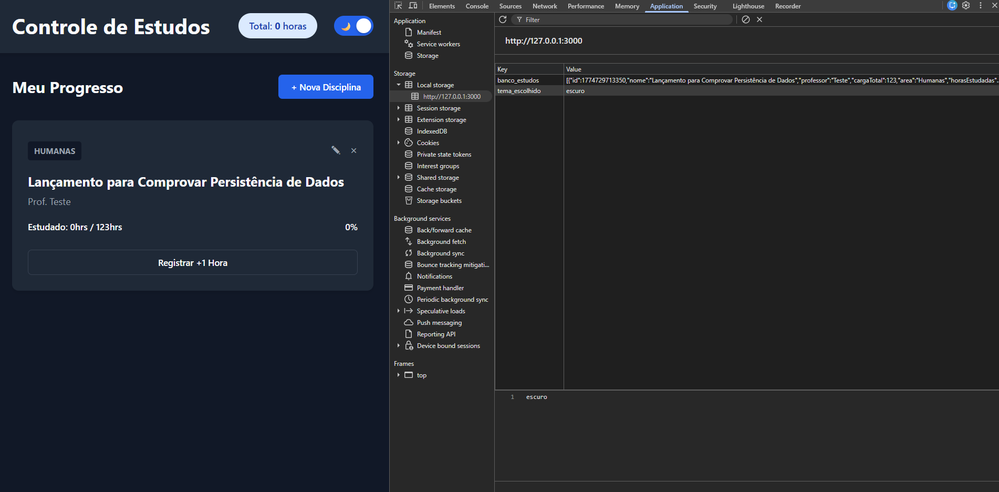

# Documentação do Projeto Controle de Estudos

Este é um sistema de front-end simples que eu criei para cadastrar disciplinas da faculdade e controlar a carga horária que eu já estudei. O projeto foi construído usando apenas HTML, CSS e JavaScript puro, sem frameworks externos.

## Como os dados são salvos (Banco de Dados)

O sistema não usa um servidor externo. Ele usa o `localStorage` do navegador para guardar as informações. 
* Ele tenta carregar os dados usando `JSON.parse(localStorage.getItem('banco_estudos'))`.
* Se não tiver nada, ele cria um array vazio `[]`.
* Toda vez que uma matéria é criada, editada ou a hora estudada muda, a função `salvarNoBanco()` transforma o array em texto com `JSON.stringify` e guarda no armazenamento local de novo.

## Como as funções principais funcionam no `script.js`

* **Cadastrar ou Editar (Interceptando o Formulário):** Quando clico em salvar, o `evento.preventDefault()` bloqueia o recarregamento da página. O sistema olha pro input escondido `id-disciplina`. Se tiver um ID lá, ele atualiza a matéria existente. Se estiver vazio, ele cria um objeto `novaDisciplina`, gerando um ID único usando o `Date.now()` (o tempo atual), e coloca as `horasEstudadas` no 0.
* **mostrarNaTela():** Limpa a tela e varre o array de matérias. Calcula a porcentagem de conclusão (`horas / cargaTotal * 100`) para a barrinha azul do topo e injeta o HTML direto usando `innerHTML`. Se o array estiver vazio, ele mostra a tela de "lista vazia".
* **registrarHora(id):** Recebe o ID do card clicado, procura no array com `.find`, e se a hora estudada for menor que a carga total, soma +1 e salva no banco. Se já bateu a meta, ele solta um `alert` e bloqueia.
* **deletarDisciplina(id):** Pede confirmação com um `confirm` e, se aceito, usa o `.filter` para recriar a lista tirando fora a matéria que tem o ID selecionado.
* **Modo Escuro:** O checkbox (botão de sol/lua) usa o `classList.toggle('modo-escuro')` no `body` da página pra trocar as variáveis de cor no CSS. Ele salva a preferência no banco local pra página já carregar escura da próxima vez, sem cegar o usuário.

---

## Checklist de Testes Funcionais

Para testar se tudo está funcionando, abra o `index.html` e siga estes passos:

- [ ] **1. Tela Vazia:** Ao abrir pela primeira vez, a div `lista-vazia` deve aparecer e o total de horas no topo deve ser 0. O `localStorage` deve estar limpo.

- [ ] **2. Criar Matéria:** Clique em "+ Nova Disciplina", preencha os inputs e salve. O modal deve fechar e o card deve aparecer na tela com a barra de progresso em 0%.

- [ ] **3. Somar Horas:** Clique em "Registrar +1 Hora". O texto no card e a barrinha azul devem atualizar na hora. O total de horas no cabeçalho também tem que subir.

- [ ] **4. Trava de Limite:** Tente clicar em "+1 Hora" além da carga total da matéria. O sistema tem que bloquear e soltar o `alert('Você já completou a carga horária dessa matéria!')`. A barra não pode passar de 100%.

- [ ] **5. Editar Dados:** Clique no botão do lápis. O modal deve abrir com os inputs já preenchidos. Mude um valor e salve. O card tem que atualizar os dados sem criar uma matéria duplicada na tela.

- [ ] **6. Excluir:** Clique no botão de "X". Confirme no alerta do navegador. O card tem que sumir da tela e ser apagado do `localStorage`.

- [ ] **7. Modo Escuro:** Clique no switch lá no topo. A tela deve ficar com o fundo escuro. Dê um F5 (recarregar a página) e valide se ela continua escura, provando que leu o `localStorage.getItem('tema_escolhido')`.

---