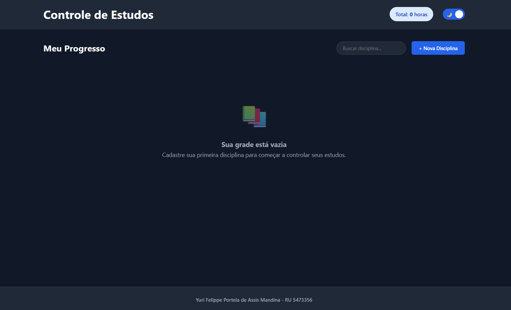
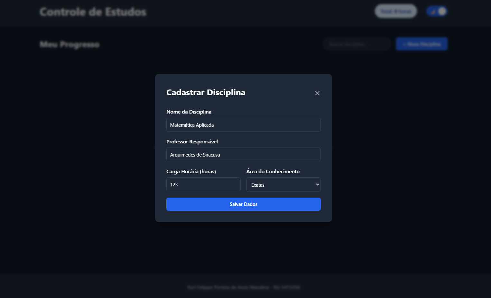
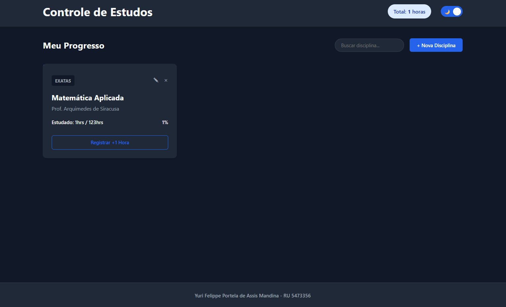
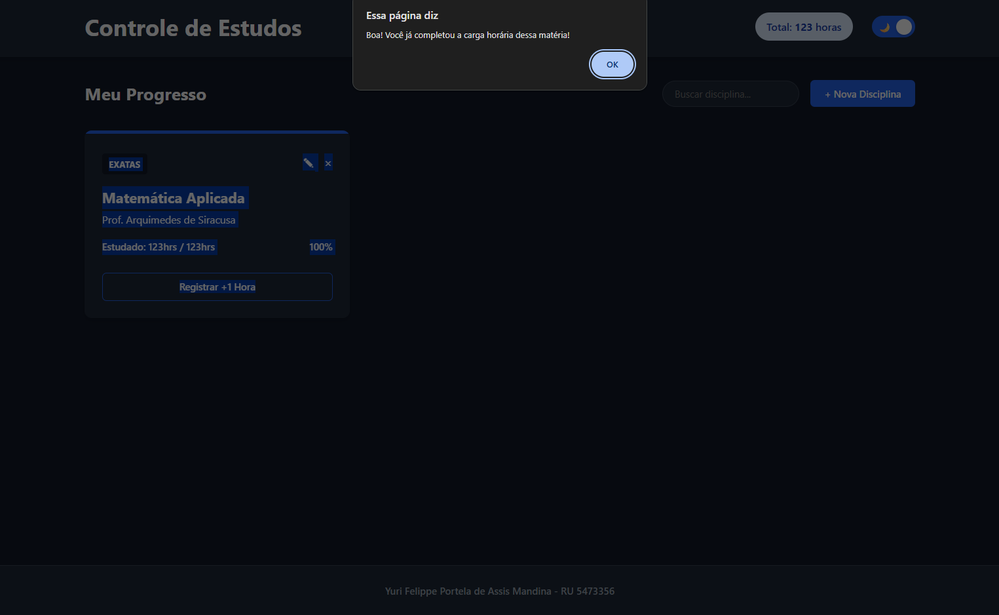
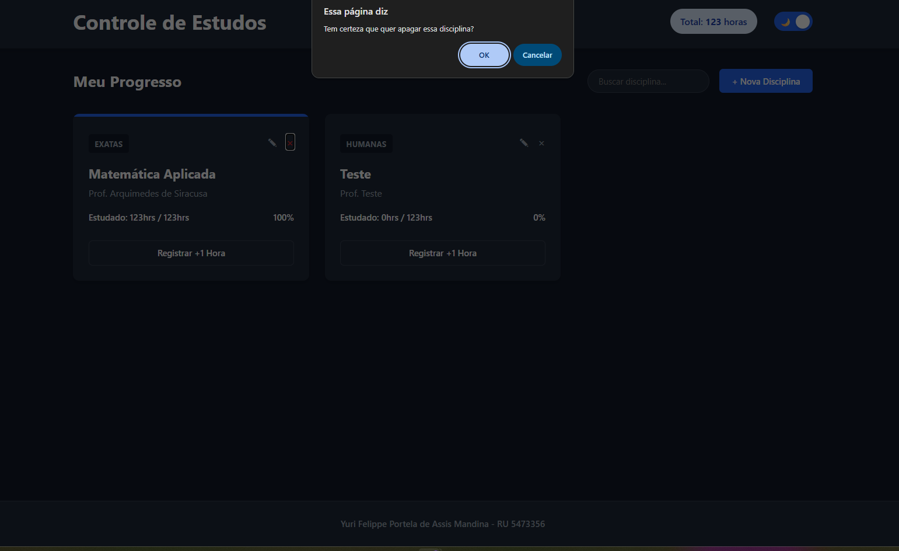
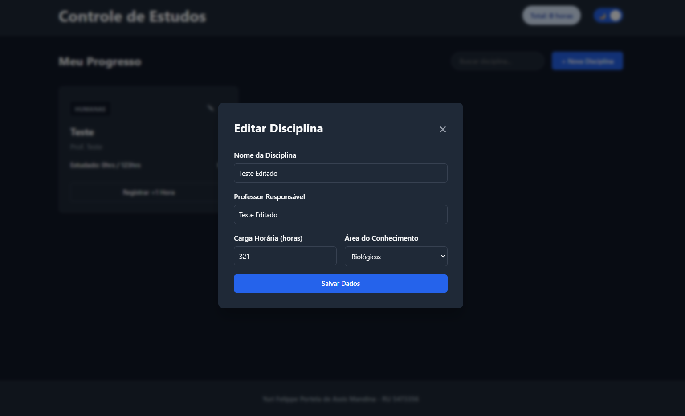
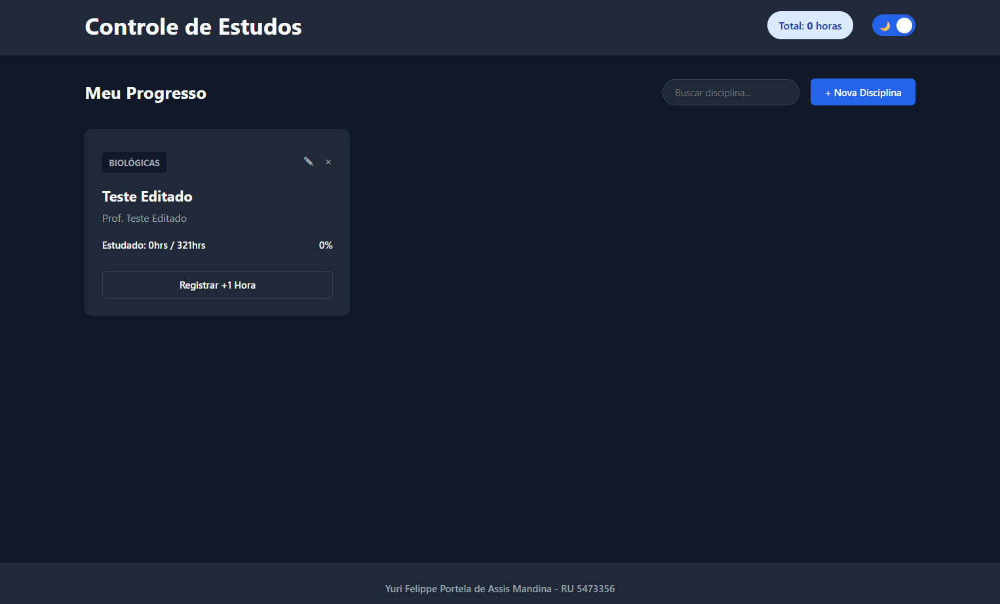
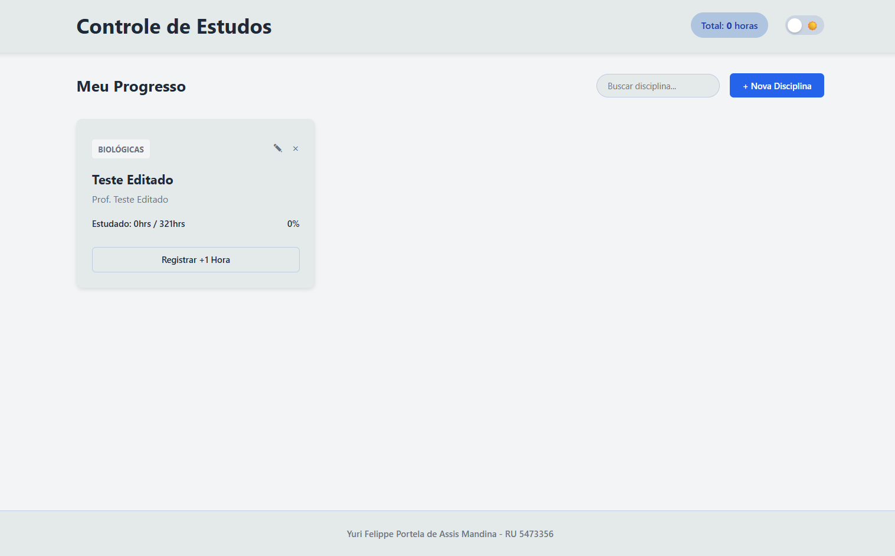
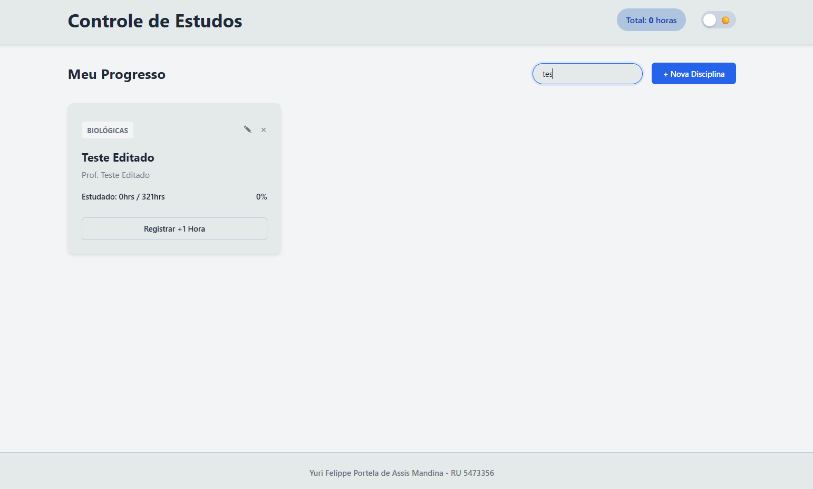
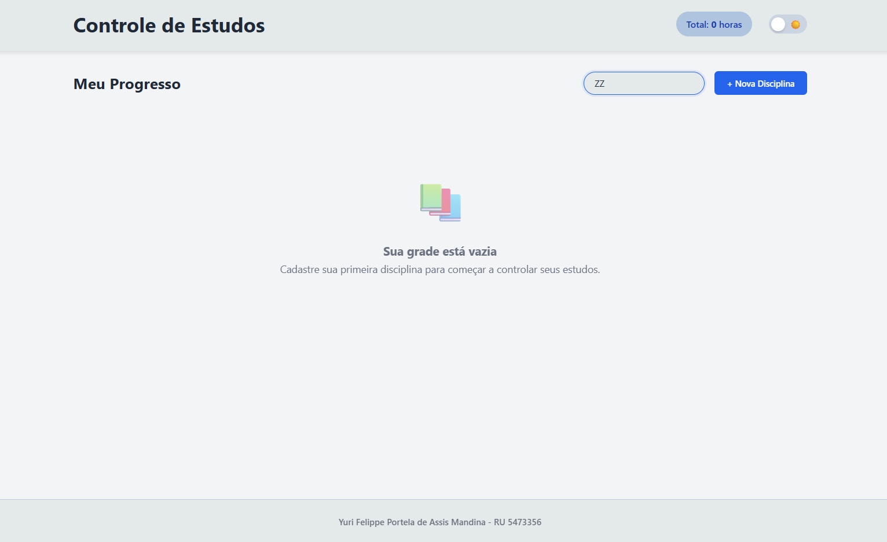

# Documentação do Projeto: Controle de Estudos

Este é um sistema de front-end desenvolvido para organizar disciplinas acadêmicas e monitorar o progresso de estudos de forma visual. O projeto foi construído utilizando HTML, CSS e JavaScript puro, com foco em performance e persistência de dados local.

---

## Arquitetura e Organização

Para garantir um código limpo e de fácil manutenção, a estrutura foi dividida em blocos de responsabilidade:

* **Semântica HTML5:** Estruturação utilizando tags nativas (`header`, `main`, `section`, `footer`) para melhor indexação e acessibilidade.
* **Layout Adaptável:** O CSS utiliza Grid Layout para a malha de cards e Flexbox para o alinhamento de componentes internos e posicionamento dinâmico do rodapé.
* **Modularização Lógica:** O JavaScript é organizado por setores: Gestão de Dados, Renderização de UI, Controle de Modais e Motor de Temas.

---

## Fluxo de Persistência (Local Storage)

O sistema opera de forma independente de servidores, utilizando o armazenamento local do navegador para garantir que os dados não sejam perdidos ao fechar a página:

* **Ciclo de Vida:** Ao carregar a página, o sistema recupera a chave `banco_estudos`. Caso esteja vazia, o estado inicial é definido como um array vazio.
* **Sincronização:** Qualquer interação que altere o estado das disciplinas aciona automaticamente a serialização dos dados para JSON, mantendo o `localStorage` sempre atualizado com a última ação do usuário.

---

## Funcionamento dos Módulos Principais

### 1. Inteligência de Cadastro e Edição
O sistema utiliza um formulário híbrido dentro de um elemento `<dialog>`. A distinção entre uma nova inserção e uma atualização de dados existentes é feita por um ID de controle:
* **Novo Registro:** O sistema gera um *timestamp* único (`Date.now()`) que servirá como chave primária da disciplina.
* **Edição:** Ao clicar em editar, os dados são mapeados de volta para o formulário. No salvamento, o sistema localiza o ID correspondente no array e sobrescreve apenas os campos alterados, preservando o histórico de horas.

### 2. Motor de Renderização Dinâmica
A função `mostrarNaTela()` atua como o núcleo da interface. Ela processa o array de dados e gera o HTML dos cards em tempo real. Durante este processo:
* **Cálculo de Progresso:** É realizada uma operação aritmética (`horas / carga * 100`) para definir dinamicamente a largura da barra de progresso (`card-indicador`).
* **Contadores Globais:** O sistema realiza a soma de todas as horas do array para atualizar o painel de estatísticas no cabeçalho.

### 3. Sistema de Registro e Travas de Segurança
A função de incremento de horas possui uma camada de validação lógica. Antes de persistir o dado, o sistema verifica se a `horaEstudada` é inferior à `cargaTotal`. Essa trava impede inconsistências visuais (como a barra de progresso ultrapassar 100% do card).

### 4. Alternador de Temas
O sistema de temas funciona através da manipulação de variáveis CSS (CSS Variables). Ao alternar o switch, o JavaScript injeta a classe `.modo-escuro` no `body`, que altera instantaneamente os valores de cores de fundo, texto e superfícies em toda a aplicação.

---

## Fluxo de Utilização

Abaixo, descrevo a jornada de uso do sistema, demonstrando como as funcionalidades interagem com o usuário:

### 1 Inicialização do Sistema
Ao acessar a aplicação pela primeira vez, o sistema valida a ausência de dados no `localStorage` e apresenta uma tela de estado vazio. Essa interface orienta o usuário a iniciar sua organização clicando no botão de cadastro.

### 2: Registro de Disciplinas
Ao acionar o comando de "Nova Disciplina", um modal de captura de dados é exibido. Aqui, o usuário define o nome, professor, carga horária e a área do conhecimento. Ao salvar, o JavaScript processa essas informações, fecha o modal e renderiza o novo card instantaneamente.

### 3: Controle de Progresso Diário
Com os cards na tela, o usuário pode interagir clicando em "Registrar +1 Hora". A cada clique, o sistema atualiza o contador individual da matéria, expande a barra de progresso visual e recalcula o total de horas globais exibido no cabeçalho.

### 4: Gestão de Limites e Metas
Caso o usuário atinja a carga horária total planejada para uma disciplina, o sistema ativa uma trava de segurança. Um alerta é exibido informando que a meta foi batida, impedindo que o progresso ultrapasse os 100% da capacidade da matéria.

### 5: Manutenção e Ajustes
A qualquer momento, o usuário pode clicar no ícone de edição para ajustar informações ou no ícone de exclusão para remover uma disciplina. O sistema solicita confirmação antes de apagar qualquer dado permanentemente do banco local.

### 6: Personalização da Experiência
Para maior conforto visual, o usuário pode alternar para o Modo Escuro. O sistema aplica as novas propriedades de cor e garante que essa escolha seja lembrada em todos os acessos futuros, mantendo a consistência da interface. Fiz todo o tutoriala apresentação no modo escuro por achar mais confortável, mas segue como fica no modo claro:

### 7: Busca e Filtro de Disciplinas
Para grades curriculares extensas, o sistema conta com um motor de busca em tempo real. Ao digitar qualquer termo no input superior, o JavaScript filtra instantaneamente a lista de renderização e exibe apenas os cards correspondentes na tela, otimizando a navegação.

---
**Desenvolvido por:** Yuri Felippe Portela de Assis Mandina - RU 5473356